# System Architecture Document
## AI Feedback Analyzer

**Version:** 1.0.0  
**Stack:** React 19 · TypeScript 6 · Vite 8 · Tailwind CSS v4 · Framer Motion 12 · Recharts 3 · React Router 7

---

## Table of Contents

1. [High-Level Architecture](#1-high-level-architecture)
2. [Component Diagram](#2-component-diagram)
3. [Folder Hierarchy](#3-folder-hierarchy)
4. [Data Flow Diagram](#4-data-flow-diagram)
5. [React Rendering Flow](#5-react-rendering-flow)
6. [Routing Flow](#6-routing-flow)
7. [Theme System](#7-theme-system)
8. [Analysis Engine Flow](#8-analysis-engine-flow)
9. [Export Flow](#9-export-flow)
10. [State Management](#10-state-management)
11. [Future Backend Architecture](#11-future-backend-architecture)
12. [Future Database Schema](#12-future-database-schema)
13. [Future Authentication](#13-future-authentication)
14. [Future API Layer](#14-future-api-layer)

---

## 1. High-Level Architecture

The application is a **fully client-side Single-Page Application**. No backend server exists. All data processing, state management, and rendering happen in the user's browser. Deployment is a static file host.

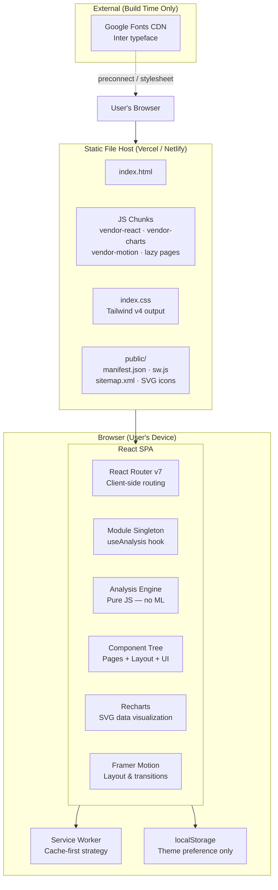

### Key architectural decisions

| Decision | Choice | Rationale |
|---|---|---|
| Rendering strategy | CSR (client-side only) | No backend needed; data stays local to the browser |
| Bundler | Vite 8 (Rolldown/Rust) | Fastest HMR, native ESM, built-in code splitting |
| Routing | React Router v7 (BrowserRouter) | Nested layouts, type-safe routes, Suspense integration |
| State | Module-level singleton | Zero setup; fits a single-user, single-tab demo |
| Styling | Tailwind CSS v4 | CSS-first config, zero runtime overhead |
| Charts | Recharts 3 | React-native SVG, good Recharts ecosystem |
| Animations | Framer Motion 12 | layoutId, AnimatePresence, spring physics |
| PWA | Service Worker + manifest | Offline support, installable on mobile |

---

## 2. Component Diagram

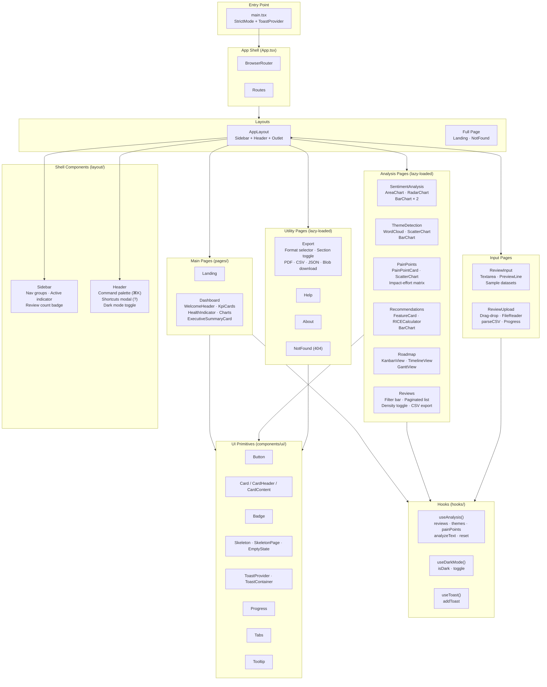

---

## 3. Folder Hierarchy

```
ai-feedback-analyzer/
│
├── public/                         # Static assets — served as-is
│   ├── index.html                  # (actually at root, not public/)
│   ├── app-logo.svg                # PWA icon + README logo
│   ├── favicon.svg                 # Browser tab icon
│   ├── icons.svg                   # Sprite sheet (unused currently)
│   ├── manifest.json               # PWA Web App Manifest
│   ├── sitemap.xml                 # XML sitemap for crawlers
│   └── sw.js                       # Service Worker (cache-first)
│
├── src/
│   ├── main.tsx                    # React root — StrictMode, ToastProvider, mountDOM
│   ├── App.tsx                     # Router, route definitions, lazy imports
│   ├── App.css                     # 3D perspective animation for landing hero
│   ├── index.css                   # Tailwind v4 import, CSS variables, @media print
│   │
│   ├── types/
│   │   └── index.ts                # Shared interfaces: Review, Theme, PainPoint,
│   │                               #   Feature, Sentiment, DashboardStats
│   │
│   ├── lib/                        # Pure utility functions — no React, no side effects
│   │   ├── analysisEngine.ts       # classifySentiment, detectThemes, estimateRating,
│   │   │                           #   parseReviewsFromText, buildThemeSummary, detectPainPoints
│   │   ├── chartColors.ts          # CHART constants, tooltipStyle, axisStyle
│   │   ├── executiveSummary.ts     # generateExecutiveSummary — template-based prose
│   │   └── utils.ts                # cn() — clsx + tailwind-merge
│   │
│   ├── hooks/                      # Reusable React hooks
│   │   ├── useAnalysis.ts          # Module singleton state + analyzeText + reset
│   │   ├── useDarkMode.ts          # localStorage + prefers-color-scheme + .dark class
│   │   └── useToast.ts             # Thin wrapper: useContext(ToastContext)
│   │
│   ├── data/                       # Static data — mock + sample datasets
│   │   ├── mockData.ts             # 15 mockReviews, mockThemes, mockPainPoints,
│   │   │                           #   mockFeatures, sentimentTrendData, ratingDistribution
│   │   └── sampleDatasets.ts       # Zepto, Swiggy, Zomato, Blinkit, Generic SaaS
│   │                               #   review strings for the input page dataset picker
│   │
│   ├── components/
│   │   ├── layout/                 # App shell — rendered on every authenticated page
│   │   │   ├── AppLayout.tsx       # useIsMobile, sidebar state, mobile backdrop,
│   │   │   │                       #   AnimatePresence page transitions, Outlet
│   │   │   ├── Sidebar.tsx         # Nav groups, Framer Motion width animation,
│   │   │   │                       #   layoutId active indicator, review count badge
│   │   │   └── Header.tsx          # CommandPalette, ShortcutsModal, dark mode toggle,
│   │   │                           #   3 × window keydown listeners
│   │   │
│   │   └── ui/                     # Design system primitives
│   │       ├── badge.tsx           # Variants: positive · negative · neutral · secondary
│   │       ├── button.tsx          # Variants: default · outline · ghost · secondary · destructive
│   │       ├── card.tsx            # Card · CardHeader · CardTitle · CardDescription · CardContent
│   │       ├── progress.tsx        # Radix Progress wrapper
│   │       ├── select.tsx          # Radix Select wrapper
│   │       ├── skeleton.tsx        # Skeleton · SkeletonCard · SkeletonChart ·
│   │       │                       #   SkeletonPage · EmptyState
│   │       ├── tabs.tsx            # Radix Tabs wrapper
│   │       ├── textarea.tsx        # Styled textarea primitive
│   │       ├── toast-context.ts    # Toast interface, ToastContextValue, createContext
│   │       ├── toast.tsx           # ToastProvider (useReducer), ToastContainer,
│   │       │                       #   auto-dismiss, 3 variants, Framer Motion animations
│   │       └── tooltip.tsx         # Radix Tooltip wrapper
│   │
│   └── pages/                      # Route-level components
│       ├── Landing.tsx             # Full-page marketing page (eager-loaded)
│       ├── Dashboard.tsx           # Main app view (eager-loaded) — 785 lines
│       ├── ReviewInput.tsx         # Paste text input + live preview (lazy)
│       ├── ReviewUpload.tsx        # Drag-drop CSV/TXT upload (lazy)
│       ├── SentimentAnalysis.tsx   # Charts: Area, Radar, Bar × 2 (lazy)
│       ├── ThemeDetection.tsx      # WordCloud, Scatter, Bar (lazy)
│       ├── PainPoints.tsx          # Pain point cards, impact/effort matrix (lazy)
│       ├── Recommendations.tsx     # RICE calculator, feature cards, bar chart (lazy)
│       ├── Roadmap.tsx             # Kanban · Timeline · Gantt views (lazy)
│       ├── Reviews.tsx             # Filterable paginated review list (lazy)
│       ├── Export.tsx              # Format selector, real PDF/CSV/JSON download (lazy)
│       ├── Help.tsx                # Guide + FAQ accordion (lazy)
│       ├── About.tsx               # Tech stack + architecture notes (lazy)
│       └── NotFound.tsx            # 404 full-page (lazy, outside AppLayout)
│
├── index.html                      # Shell HTML — SEO meta, OG tags, manifest link
├── vite.config.ts                  # Plugins, alias, manualChunks code splitting
├── tsconfig.json                   # Project references
├── tsconfig.app.json               # App compiler options — strict, verbatimModuleSyntax
├── tsconfig.node.json              # Vite config compiler options
├── package.json                    # Dependencies + scripts
├── README.md                       # Portfolio documentation
├── ARCHITECTURE.md                 # This file
├── CHANGELOG.md                    # Version history
├── CONTRIBUTING.md                 # Development guide
└── .env.example                    # Environment variable template
```

---

## 4. Data Flow Diagram

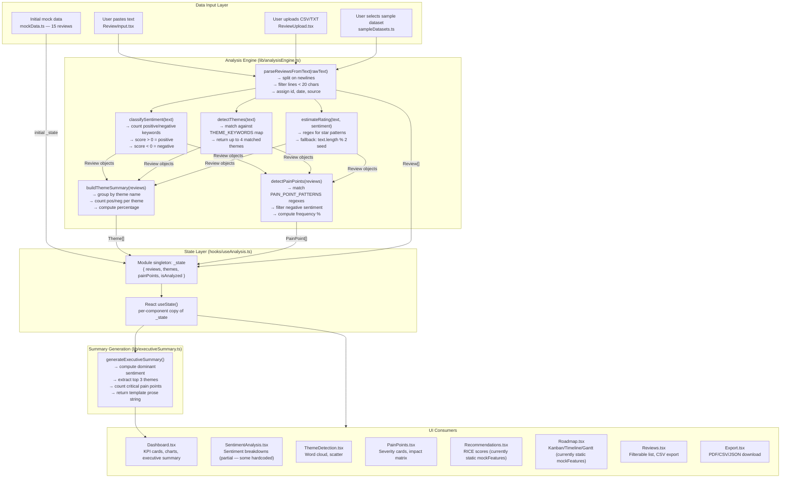

---

## 5. React Rendering Flow

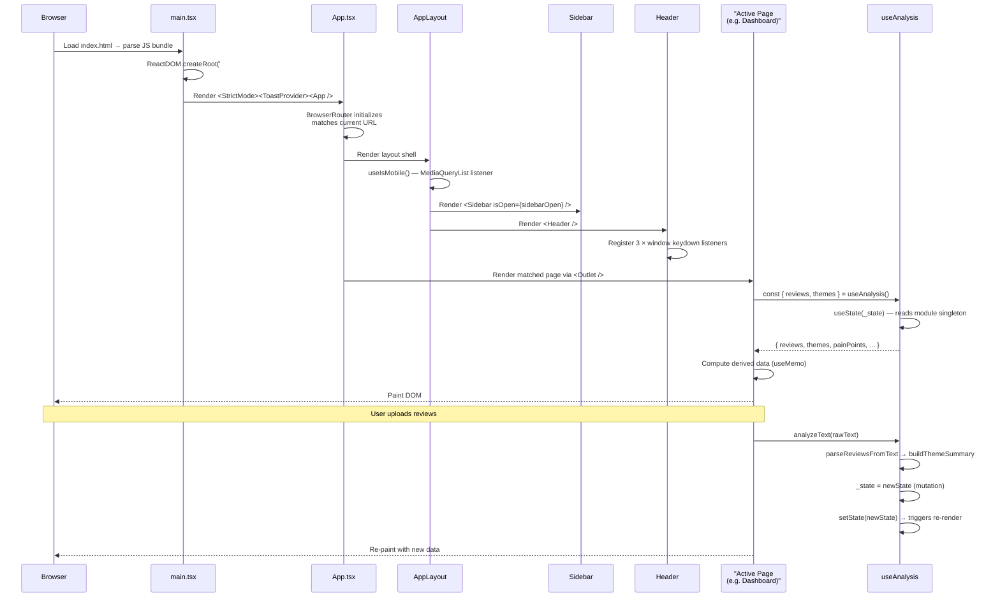

---

## 6. Routing Flow

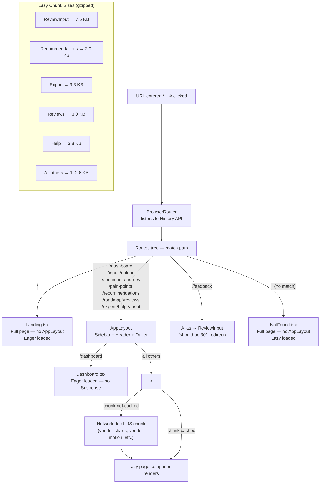

### Route table

| Path | Component | Layout | Load strategy |
|---|---|---|---|
| `/` | Landing | None | Eager |
| `/dashboard` | Dashboard | AppLayout | Eager |
| `/input` | ReviewInput | AppLayout | Lazy |
| `/upload` | ReviewUpload | AppLayout | Lazy |
| `/sentiment` | SentimentAnalysis | AppLayout | Lazy |
| `/themes` | ThemeDetection | AppLayout | Lazy |
| `/pain-points` | PainPoints | AppLayout | Lazy |
| `/recommendations` | Recommendations | AppLayout | Lazy |
| `/roadmap` | Roadmap | AppLayout | Lazy |
| `/reviews` | Reviews | AppLayout | Lazy |
| `/export` | Export | AppLayout | Lazy |
| `/help` | Help | AppLayout | Lazy |
| `/about` | About | AppLayout | Lazy |
| `/feedback` | ReviewInput (alias) | AppLayout | Lazy |
| `*` | NotFound | None | Lazy |

---

## 7. Theme System

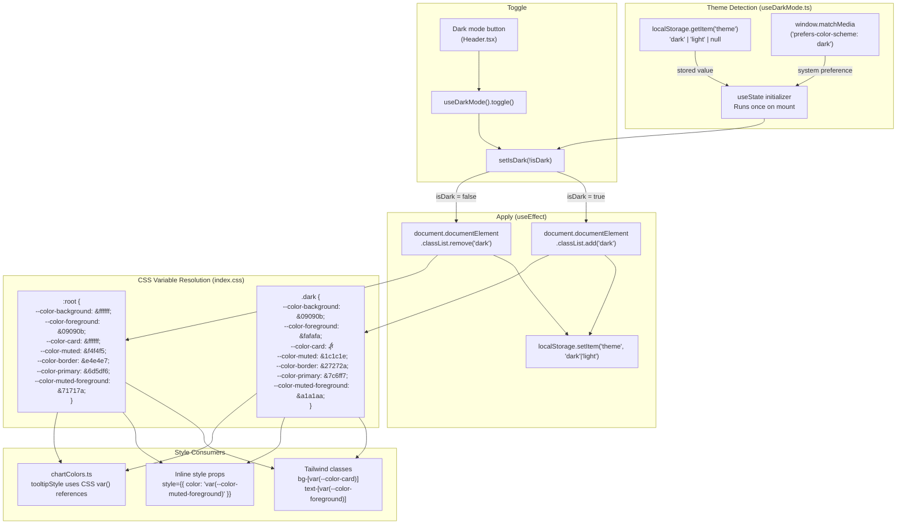

### CSS variable map

| Token | Light | Dark | Usage |
|---|---|---|---|
| `--color-background` | `#ffffff` | `#09090b` | Page background |
| `--color-foreground` | `#09090b` | `#fafafa` | Primary text |
| `--color-card` | `#ffffff` | `#111113` | Card surfaces |
| `--color-muted` | `#f4f4f5` | `#1c1c1e` | Subtle backgrounds |
| `--color-border` | `#e4e4e7` | `#27272a` | Dividers, input borders |
| `--color-primary` | `#6d5df6` | `#7c6ff7` | Brand purple |
| `--color-muted-foreground` | `#71717a` | `#a1a1aa` | Secondary text |
| `--color-ring` | `#6d5df6` | `#7c6ff7` | Focus rings |

---

## 8. Analysis Engine Flow

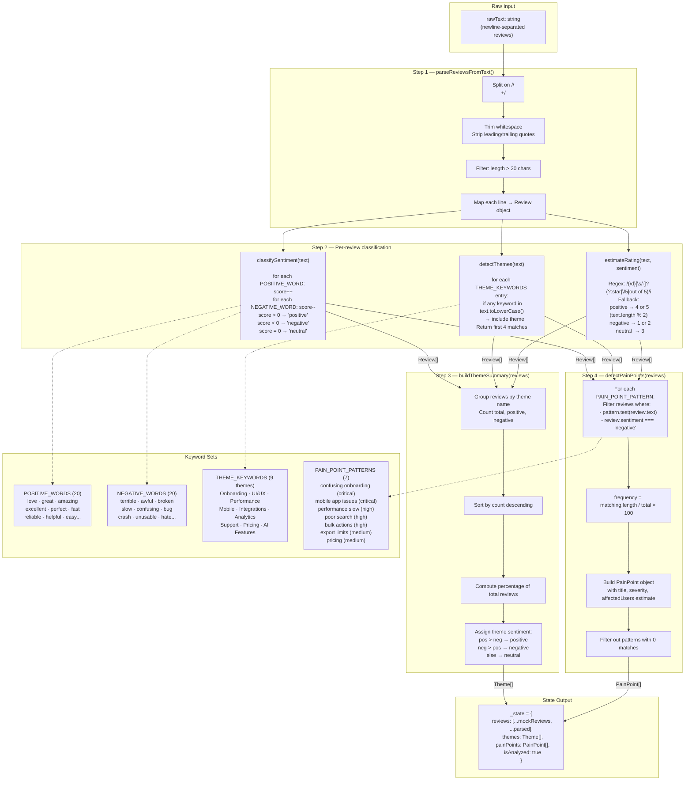

---

## 9. Export Flow

```mermaid
flowchart TD
    User["User selects format\n+ configures sections"]

    subgraph PDF["PDF Export"]
        PrintCall["window.print()\nafter 400ms delay"]
        MediaPrint["@media print CSS\n→ hide sidebar, header\n→ full-width content\n→ page-break-inside: avoid"]
        PrintDialog["Browser print dialog\n'Save as PDF' option"]
        PDFFile["PDF file on disk"]
    end

    subgraph CSV["CSV Export (real)"]
        CSVHeader["Build header row:\nID, Text, Source, Date, Rating, Sentiment, Themes"]
        CSVRows["Map reviews → CSV rows\nEscape quotes: replace ' with ''"]
        CSVBlob["new Blob([csv], { type: 'text/csv' })"]
        CSVUrl["URL.createObjectURL(blob)"]
        CSVAnchor["<a href=url download=filename>\na.click() → browser saves file"]
        CSVCleanup["setTimeout → URL.revokeObjectURL()\n(free memory after 100ms)"]
    end

    subgraph JSON["JSON Export (real)"]
        JSONData["Build data object:\n{ generatedAt, totalReviews,\n  reviews[], themes[], painPoints[],\n  sections[] }"]
        JSONBlob["new Blob([JSON.stringify(data, null, 2)],\n{ type: 'application/json' })"]
        JSONAnchor["Same anchor click pattern as CSV"]
    end

    subgraph Simulated["Simulated (Excel / PPTX)"]
        FakeProgress["setStatus('generating')\n2.5s setTimeout"]
        FakeDone["setStatus('done')\nshowToast('Export complete')"]
    end

    Toast["useToast().addToast()\n→ success notification"]

    User -->|"pdf"| PDF
    User -->|"csv"| CSV
    User -->|"json"| JSON
    User -->|"excel or pptx"| Simulated

    PrintCall --> MediaPrint --> PrintDialog --> PDFFile
    CSVHeader --> CSVRows --> CSVBlob --> CSVUrl --> CSVAnchor --> CSVCleanup
    JSONData --> JSONBlob --> JSONAnchor

    PDF & CSV & JSON --> Toast
    Simulated --> FakeProgress --> FakeDone --> Toast
```

---

## 10. State Management

```mermaid
flowchart TD
    subgraph Current["Current Implementation"]
        ModuleSingleton["Module-level singleton\nlet _state: AnalysisState\n\nDeclared once at module import time\nLives for full page lifetime\nAll useAnalysis() calls share it"]

        Hook["useAnalysis() hook\nconst [state, setState] = useState(_state)\n\nReads from singleton on mount\nWrites back via setState for current component\nOther mounted components do NOT update"]

        DarkLS["useDarkMode()\nReads: localStorage.getItem('theme')\nWrites: localStorage.setItem()\nApplies: document.documentElement.classList"]

        ToastCtx["ToastContext + useReducer\nIn-memory array of active toasts\nauto-dismiss via setTimeout\nPropagates to all consumers via Context"]
    end

    subgraph Problems["Known Problems"]
        P1["Multi-tab isolation — each tab\nhas its own module instance"]
        P2["Stale state — mounted siblings\ndon't re-render on _state mutation"]
        P3["StrictMode double-mount\nmay see dirty _state"]
        P4["No persistence — refresh\nresets to mockReviews"]
    end

    subgraph Future["Recommended: Zustand Store"]
        ZustandStore["create<AnalysisStore>((set, get) => ({\n  reviews: [],\n  themes: [],\n  painPoints: [],\n  isAnalyzed: false,\n\n  analyzeText: (rawText) => {\n    const parsed = parseReviewsFromText(rawText)\n    set({\n      reviews: parsed,\n      themes: buildThemeSummary(parsed),\n      painPoints: detectPainPoints(parsed),\n      isAnalyzed: true,\n    })\n  },\n\n  reset: () => set({ reviews: [], isAnalyzed: false }),\n}))"]

        PersistMiddleware["persist middleware\n→ localStorage serialization\n→ reviews survive page refresh"]

        DevtoolsMiddleware["devtools middleware\n→ Redux DevTools support\n→ time-travel debugging"]
    end

    Current --> Problems
    Problems -.->|"migration path"| Future
```

### State inventory

| State | Location | Persisted | Scope |
|---|---|---|---|
| `reviews[]` | Module singleton | No — resets on refresh | App |
| `themes[]` | Module singleton | No | App |
| `painPoints[]` | Module singleton | No | App |
| `isDark` | `useDarkMode` + localStorage | Yes — localStorage | App |
| `sidebarOpen` | `AppLayout` useState | No | Layout |
| `isMobile` | `AppLayout` useIsMobile | No (derived) | Layout |
| `cmdOpen` | `Header` useState | No | Component |
| `shortcutsOpen` | `Header` useState | No | Component |
| `toasts[]` | `ToastProvider` useReducer | No | App |
| `search`, `filters`, `page` | `Reviews` useState | No | Page |
| `compact` (density) | `Reviews` useState | No | Page |
| `selected format` | `Export` useState | No | Page |
| `enabledSections` | `Export` useState | No | Page |

---

## 11. Future Backend Architecture

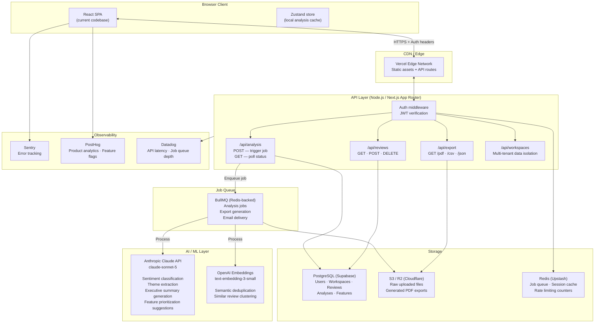

---

## 12. Future Database Schema

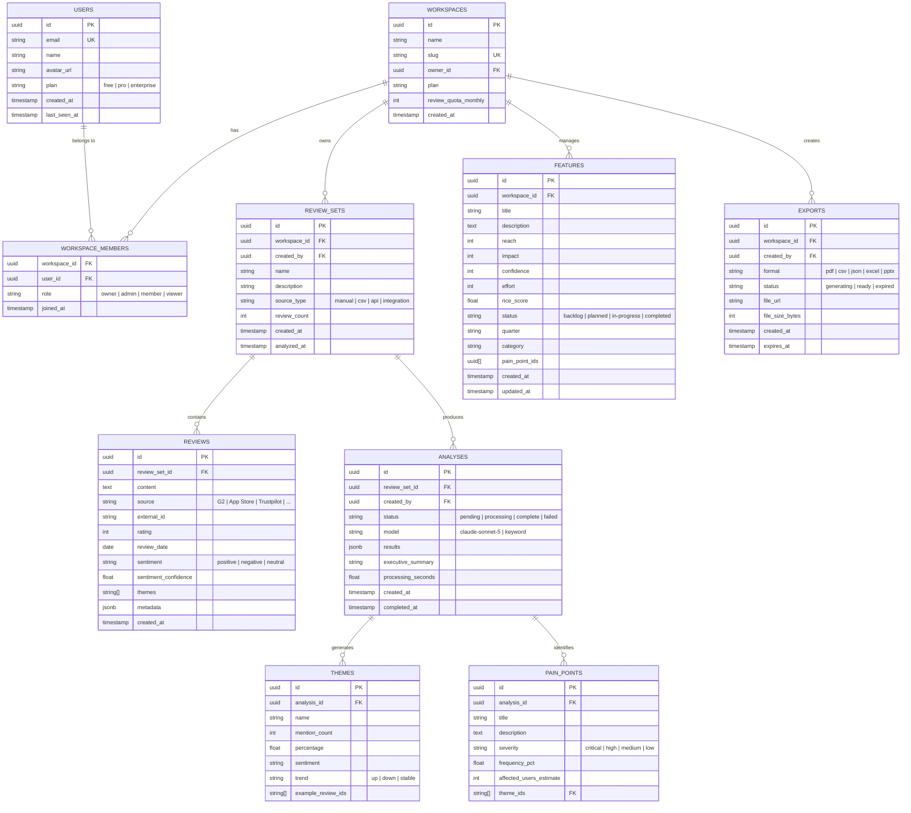

### Index strategy

```sql
-- Hot query paths
CREATE INDEX idx_reviews_set_id ON reviews(review_set_id);
CREATE INDEX idx_reviews_sentiment ON reviews(review_set_id, sentiment);
CREATE INDEX idx_reviews_source ON reviews(review_set_id, source);
CREATE INDEX idx_reviews_date ON reviews(review_set_id, review_date DESC);
CREATE INDEX idx_analyses_workspace ON analyses(review_set_id, status);
CREATE INDEX idx_features_workspace ON features(workspace_id, status);

-- Full-text search on review content
CREATE INDEX idx_reviews_fts ON reviews USING gin(to_tsvector('english', content));
```

---

## 13. Future Authentication

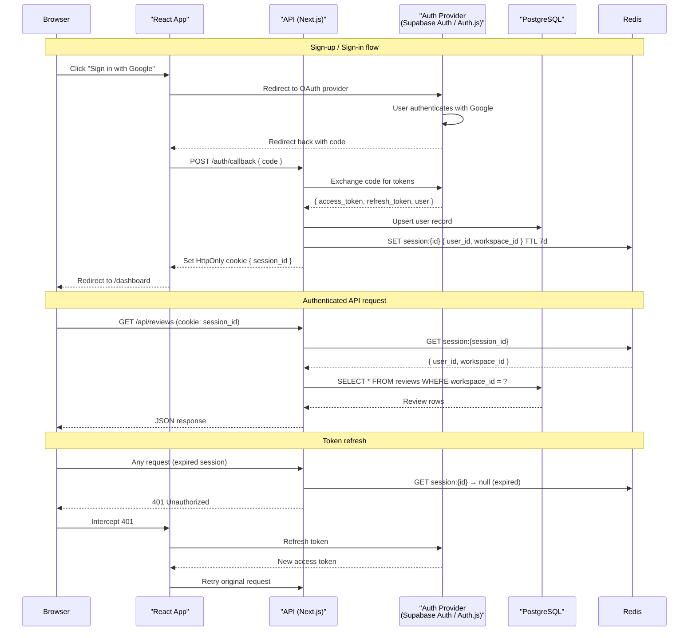

### Auth strategy decisions

| Concern | Decision | Rationale |
|---|---|---|
| Provider | Supabase Auth | Handles OAuth, magic links, JWT — minimal custom code |
| Session storage | HttpOnly cookie (not localStorage) | Prevents XSS token theft |
| Session duration | 7-day sliding window | Balance security vs. UX |
| MFA | TOTP (Google Authenticator) | Required for Enterprise plan |
| Row-level security | Postgres RLS policies | `workspace_id` on every query — data isolation at DB level |
| API keys | SHA-256 hashed in DB | For server-to-server integrations |

### Postgres Row Level Security

```sql
-- Users can only read reviews in their workspace
ALTER TABLE reviews ENABLE ROW LEVEL SECURITY;

CREATE POLICY reviews_workspace_isolation ON reviews
  FOR ALL
  USING (
    review_set_id IN (
      SELECT id FROM review_sets
      WHERE workspace_id IN (
        SELECT workspace_id FROM workspace_members
        WHERE user_id = auth.uid()
      )
    )
  );
```

---

## 14. Future API Layer

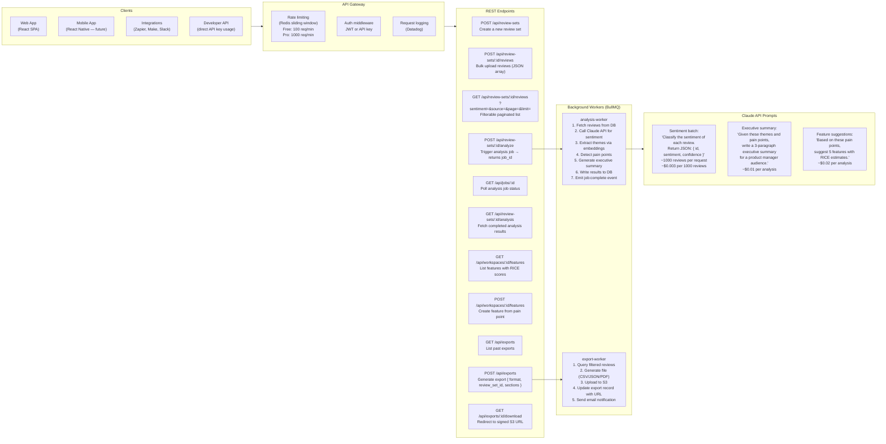

### API response envelope

```typescript
// All API responses follow this shape
interface APIResponse<T> {
  data: T | null
  error: {
    code: string           // "UNAUTHORIZED" | "QUOTA_EXCEEDED" | "NOT_FOUND" | ...
    message: string        // Human-readable
    details?: unknown      // Validation errors, etc.
  } | null
  meta: {
    request_id: string     // For support/debugging
    timestamp: string      // ISO 8601
    version: string        // API version: "2025-01-01"
  }
}

// Paginated list responses
interface PaginatedResponse<T> extends APIResponse<T[]> {
  pagination: {
    page: number
    limit: number
    total: number
    has_next: boolean
  }
}
```

### Rate limiting strategy

```
Free plan:    100 requests/minute · 500 reviews/analysis · 1 workspace
Pro plan:    1000 requests/minute · 10,000 reviews/analysis · 5 workspaces
Enterprise:  Custom limits · Unlimited reviews · SSO · SLA
```

### Webhook events (future)

```typescript
// Events emitted to customer webhook URLs
type WebhookEvent =
  | { type: 'analysis.completed'; data: { review_set_id: string; analysis_id: string } }
  | { type: 'analysis.failed';    data: { review_set_id: string; error: string } }
  | { type: 'export.ready';       data: { export_id: string; download_url: string } }
  | { type: 'quota.warning';      data: { used: number; limit: number; reset_at: string } }
```

---

## Bundle size breakdown

| Chunk | Size (raw) | Size (gzip) | Contents |
|---|---|---|---|
| `index.js` | 83 KB | 21 KB | App shell, router, layouts, hooks, Dashboard |
| `vendor-charts` | 393 KB | 103 KB | Recharts + D3 dependencies |
| `vendor-react` | 216 KB | 69 KB | React DOM + React Router |
| `vendor` | 206 KB | 71 KB | Other node_modules |
| `vendor-motion` | 33 KB | 11 KB | Framer Motion |
| Lazy pages (×12) | 2–20 KB each | 1–8 KB each | All secondary pages |
| **Total transferred** | **~930 KB** | **~283 KB** | First load (all chunks) |
| **Initial load** | **83 KB** | **21 KB** | Before any navigation |

---

*Document generated 2026-07-20. Reflects codebase at v1.0.0.*
