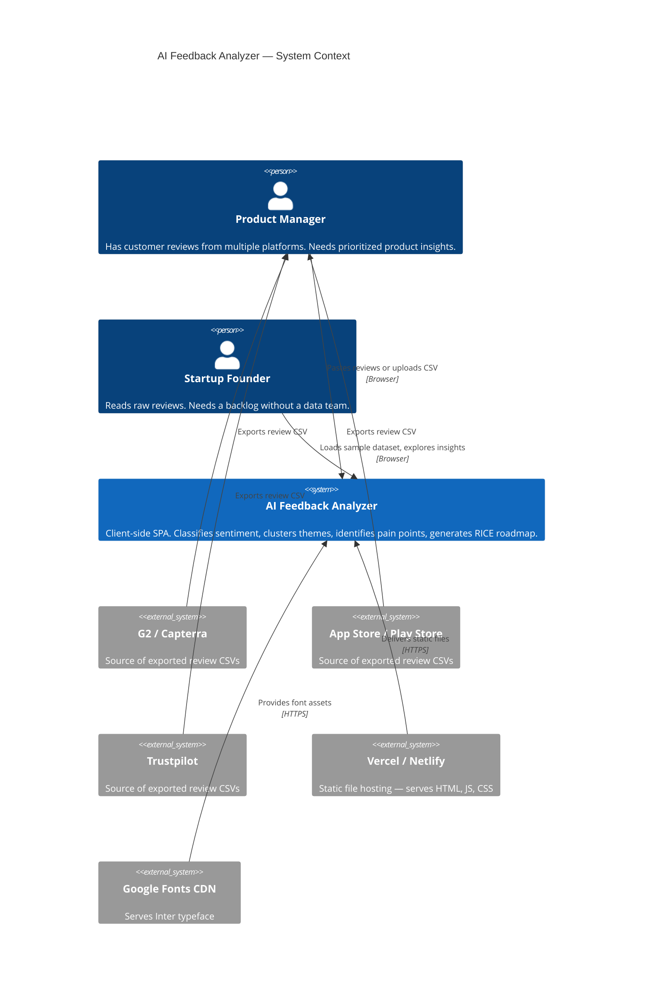
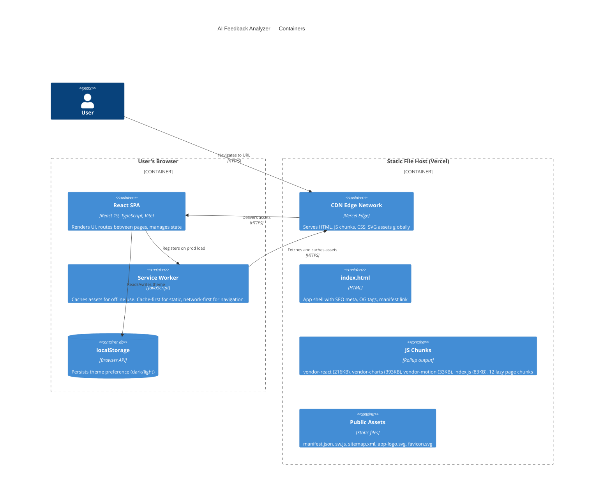
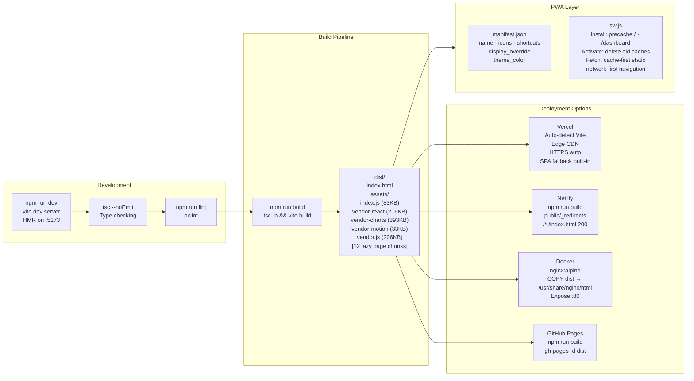
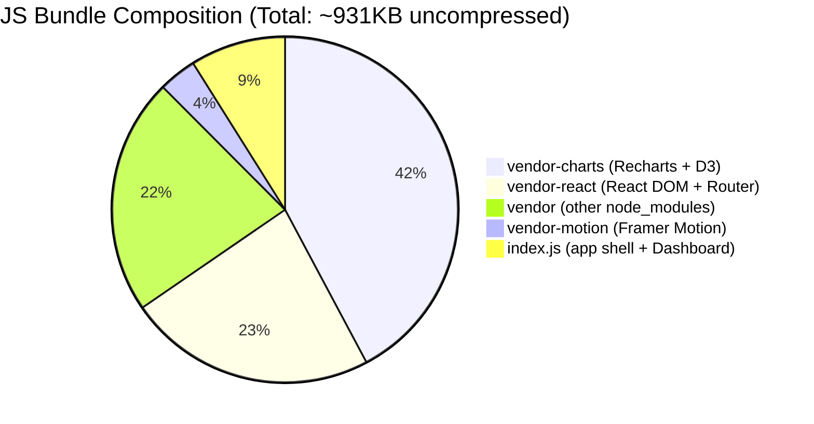
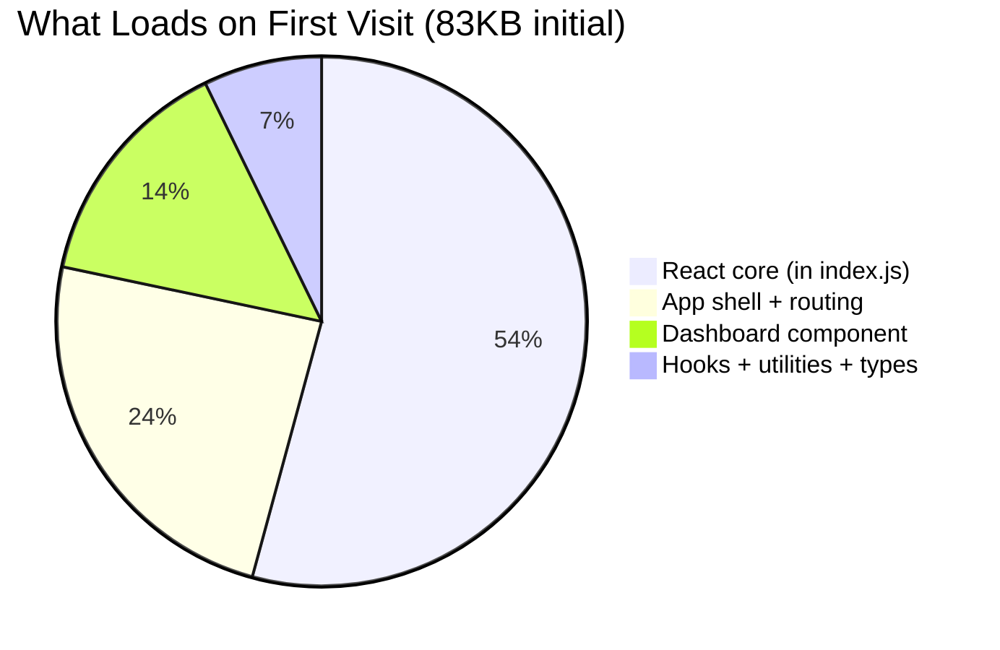
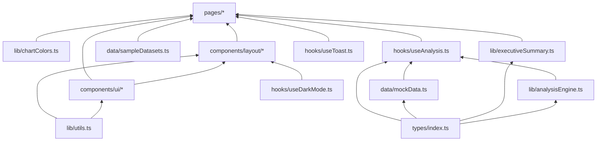

# Architecture Diagrams — AI Feedback Analyzer

All diagrams use Mermaid syntax. Render in GitHub, GitLab, Notion, or any Mermaid-compatible viewer.

---

## 1. System Context Diagram

The highest-level view — who uses the system and what it interacts with.

---

## 2. Container Diagram

What the system is made of — the major deployable units and how they communicate.

---

## 3. Component Diagram (Layer View)

How the internal React layers relate — from shell to leaves.

```mermaid
graph TB
    subgraph Entry["Entry Layer"]
        main["main.tsx\nReactDOM.createRoot\nStrictMode\nToastProvider"]
    end

    subgraph Shell["App Shell Layer"]
        App["App.tsx\nBrowserRouter\nRoute definitions\nLazy imports"]
    end

    subgraph Layout["Layout Layer"]
        AppLayout["AppLayout.tsx\nSidebar state\nuseIsMobile\nAnimatePresence\nOutlet"]
        Sidebar["Sidebar.tsx\nNav groups\nlayoutId animation\nReview count badge"]
        Header["Header.tsx\nCommandPalette\nShortcutsModal\nDark mode toggle\n3× keydown listener"]
    end

    subgraph Pages_Eager["Eager Pages"]
        Landing["Landing.tsx\n682 lines\nMarketing page\nNo AppLayout"]
        Dashboard["Dashboard.tsx\n785 lines\nKpiCard × 4\nExecutiveSummaryCard\nHealthIndicator\nWelcomeHeader\n6 charts"]
    end

    subgraph Pages_Lazy["Lazy Pages (Suspense-wrapped)"]
        Input["ReviewInput\nPreviewLine\nDataset picker"]
        Upload["ReviewUpload\nDrag-drop\nparseCSV\nFileReader"]
        Sentiment["SentimentAnalysis\n4 charts"]
        Themes["ThemeDetection\nWordCloud\nScatter"]
        Pain["PainPoints\nSeverity cards\nImpact matrix"]
        Recs["Recommendations\nRICECalculator\nFeatureCard"]
        Road["Roadmap\nKanban\nTimeline\nGantt"]
        Reviews["Reviews\nFilter bar\nPagination\nDensity toggle"]
        Export["Export\nFormat picker\nBlob download\nwindow.print"]
        Help["Help"] 
        About["About"]
        NotFound["NotFound\nNo AppLayout"]
    end

    subgraph UIKit["UI Primitive Layer (components/ui/)"]
        Button["Button\n6 variants"]
        Card["Card family\nHeader/Title/Description/Content"]
        Badge["Badge\n4 variants"]
        Skeleton["Skeleton\nSkeletonCard\nSkeletonChart\nSkeletonPage\nEmptyState"]
        Toast["ToastProvider\nToastContainer\nToastContext"]
        Radix["Radix UI wrappers\nProgress · Select · Tabs · Tooltip · Accordion"]
    end

    subgraph DataLayer["Data & Logic Layer"]
        useAnalysis["useAnalysis()\nModule singleton\nanalyzeText\nreset"]
        useDarkMode["useDarkMode()\nlocalStorage\nprefers-color-scheme\n.dark class"]
        useToast["useToast()\nContext wrapper"]
        Engine["analysisEngine.ts\nclassifySentiment\ndetectThemes\nestimateRating\nparseReviewsFromText\nbuildThemeSummary\ndetectPainPoints"]
        Summary["executiveSummary.ts\ngenerateExecutiveSummary"]
        Colors["chartColors.ts\nCHART constants\ntooltipStyle\naxisStyle"]
        Mock["mockData.ts\n15 reviews\n12 themes\n8 pain points\n8 features\nchart arrays"]
        Samples["sampleDatasets.ts\nZepto · Swiggy\nZomato · Blinkit\nGeneric SaaS"]
        Types["types/index.ts\nReview · Theme\nPainPoint · Feature\nSentiment · DashboardStats"]
    end

    main --> App
    App --> Layout
    App --> Pages_Eager
    App --> Pages_Lazy
    Layout --> UIKit
    Pages_Eager --> UIKit
    Pages_Lazy --> UIKit
    Pages_Eager --> DataLayer
    Pages_Lazy --> DataLayer
    Layout --> DataLayer
```

---

## 4. Deployment Architecture

---

## 5. State Architecture Diagram

```mermaid
graph TD
    subgraph Current["Current State Model"]
        subgraph ModSingleton["Module Singleton (useAnalysis.ts)"]
            LState["let _state: AnalysisState\n= { reviews: mockReviews,\n    themes: mockThemes,\n    painPoints: mockPainPoints,\n    isAnalyzed: true }"]
        end

        subgraph ReactLocal["Per-Component React State"]
            RS1["Component A\nuseState(_state) → stateA"]
            RS2["Component B\nuseState(_state) → stateB"]
            RS3["Component C\nuseState(_state) → stateC"]
        end

        subgraph Problem["Problem: No Broadcast"]
            Mut["analyzeText() mutates _state\nCalls setState on Component A only\nB and C remain stale\nuntil remount"]
        end

        LState --> RS1 & RS2 & RS3
        RS1 -->|"analyzeText()"| Mut
        Mut -.->|"❌ does NOT update"| RS2 & RS3
    end

    subgraph Future["Recommended: Zustand"]
        ZStore["create() store\n{ reviews, themes, painPoints\n  analyzeText(), reset() }"]
        ZSub1["Component A\nuseAnalysis(state => state.reviews)"]
        ZSub2["Component B\nuseAnalysis(state => state.themes)"]
        ZSub3["Component C\nuseAnalysis(state => state.painPoints)"]
        ZDispatch["analyzeText() calls set()\nAll subscribers re-render\nAutomatically"]
        ZPersist["persist middleware\nserializes to localStorage\nSurvives page refresh"]

        ZStore --> ZSub1 & ZSub2 & ZSub3
        ZSub1 -->|"set()"| ZDispatch
        ZDispatch -->|"✅ updates all"| ZSub1 & ZSub2 & ZSub3
        ZStore --- ZPersist
    end

    subgraph OtherState["Other State (correct as-is)"]
        DarkMode["useDarkMode()\n→ localStorage\n→ document.documentElement.classList"]
        ToastCtx["ToastContext + useReducer\n→ React Context\n→ broadcasts to all consumers"]
        LocalUI["Component-local useState\nsidebarOpen · compact · page\nsearch · filters · status"]
    end
```

---

## 6. Bundle Composition Diagram

---

## 7. Layer Dependencies (no circular dependencies)

All dependencies flow upward — no circular imports.
