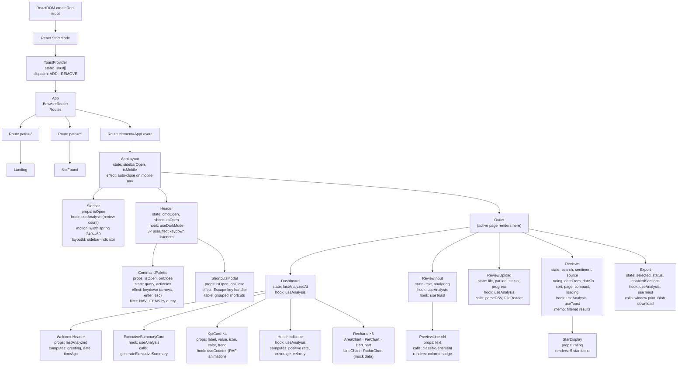
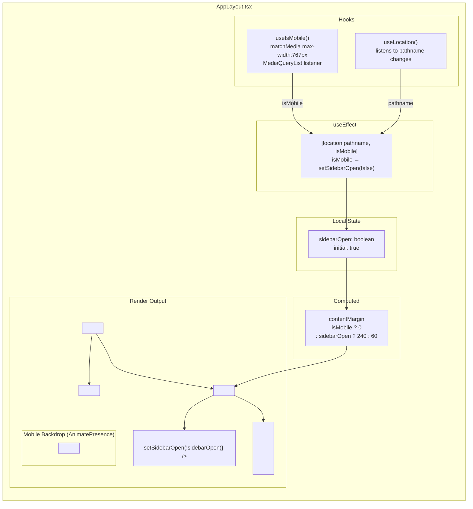
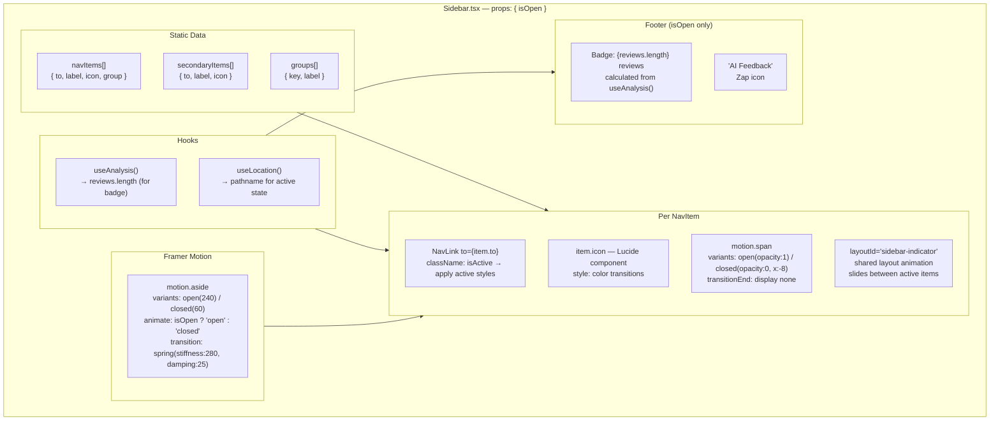
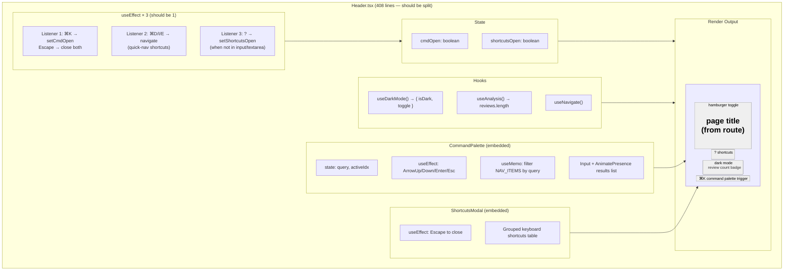
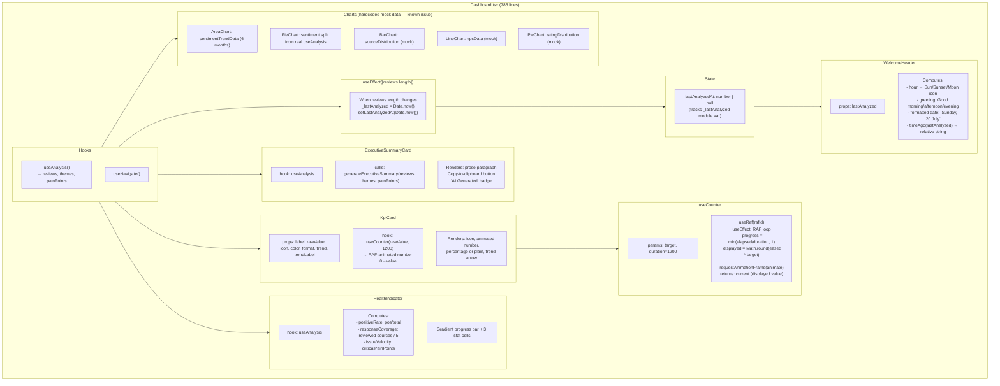
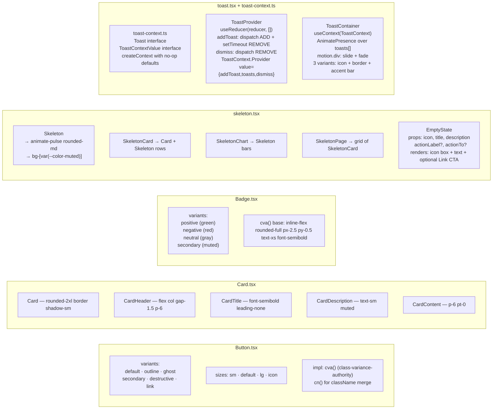

# Component Diagrams — AI Feedback Analyzer

Detailed component breakdowns: props, state, hooks, and relationships for every major component.

---

## 1. Full Component Tree (Hierarchical)

---

## 2. AppLayout Component

---

## 3. Sidebar Component

---

## 4. Header Component

---

## 5. Dashboard Component (Composition View)

---

## 6. UI Primitive Components

---

## 7. Analysis Pages — Shared Pattern

Every analysis page follows this exact structure:

```mermaid
graph TD
    subgraph AnalysisPagePattern["Analysis Page Pattern (Sentiment · Themes · PainPoints · Recommendations · Roadmap)"]

        subgraph Imports["Imports"]
            I1["Recharts components"]
            I2["Lucide icons"]
            I3["Card, Badge, Button (UI kit)"]
            I4["CHART, tooltipStyle, axisStyle (chartColors)"]
            I5["useAnalysis (real data)"]
            I6["mockData (chart arrays — partial)"]
            I7["SkeletonPage"]
            I8["motion from framer-motion"]
        end

        subgraph LocalState["Local State"]
            LS1["loading: boolean (true)"]
            LS2["page-specific UI state\n(selected tab, expanded card, etc.)"]
        end

        subgraph LoadEffect["useEffect([], [])"]
            LE["setTimeout(() => setLoading(false), 600)\nreturn clearTimeout"]
        end

        subgraph EarlyReturn["Early Return"]
            ER["if (loading) return <SkeletonPage />"]
        end

        subgraph PageRender["Page Render"]
            PR["<motion.div\ninitial: opacity 0, y 8\nanimate: opacity 1, y 0\ntransition: duration 0.25, easeInOut>"]
            PR --> GRID["Stat cards grid\n(from useAnalysis or mock)"]
            PR --> CHARTS["Chart grid\n(ResponsiveContainer + chart type)"]
            PR --> DETAIL["Detail cards / table\n(from useAnalysis)"]
        end
    end

    Imports --> LocalState
    LocalState --> LoadEffect
    LoadEffect --> EarlyReturn
    EarlyReturn --> PageRender
```

---

## 8. Props and Data Flow Map

```mermaid
graph LR
    subgraph DataSources["Data Sources"]
        MS["_state module singleton\n{ reviews[], themes[], painPoints[] }"]
        MD["mockData.ts\nsentimentTrendData\nratingDistribution\nnpsData\nmockFeatures"]
    end

    subgraph HookBoundary["Hook Boundary"]
        UA["useAnalysis()\nreturns { ...state, analyzeText, reset }"]
    end

    subgraph DirectConsumers["Components using useAnalysis()"]
        Dash2["Dashboard → reviews, themes, painPoints"]
        RI2["ReviewInput → analyzeText"]
        RU2["ReviewUpload → analyzeText, reset"]
        Rev["Reviews → reviews"]
        Exp["Export → reviews, themes, painPoints"]
        ES2["ExecutiveSummaryCard → reviews, themes, painPoints"]
        HI2["HealthIndicator → reviews, painPoints"]
        SB2["Sidebar → reviews.length"]
    end

    subgraph MockConsumers["Components using mockData directly (known issue)"]
        SAM["SentimentAnalysis → sentimentTrendData, ratingDistribution"]
        RdM["Roadmap → mockFeatures"]
        RecM["Recommendations → mockFeatures"]
    end

    MS --> UA
    UA --> DirectConsumers
    MD --> MockConsumers
```

