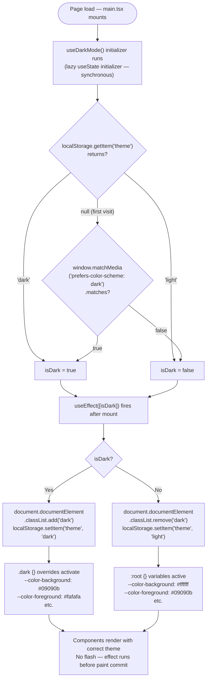
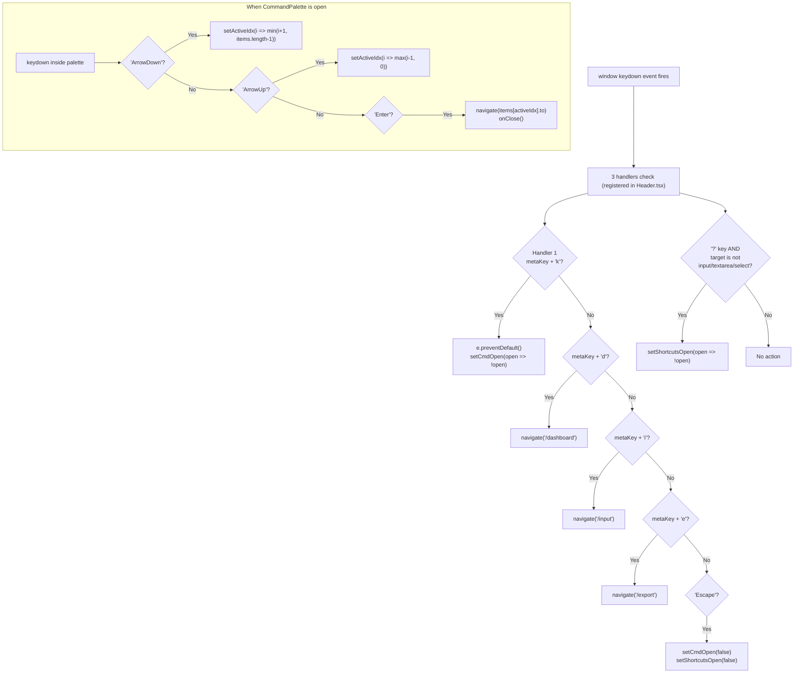

# Flowcharts — AI Feedback Analyzer

Decision trees and process flows for every major system behavior.

---

## 1. User Journey — First Visit to First Insight

```mermaid
flowchart TD
    Start([User lands on site]) --> Landing["/\nLanding page renders"]
    Landing --> Decision{Has reviews to analyze?}

    Decision -->|"No — want to try it"| SamplePath[Click sample dataset button]
    Decision -->|"Yes — has CSV"| UploadPath[Click 'Upload Reviews'\n→ /upload]
    Decision -->|"Yes — has raw text"| InputPath[Click 'Start Analyzing'\n→ /input]

    SamplePath --> SelectDS[ReviewInput\nSelect: Zepto / Swiggy / Zomato / Blinkit / Generic]
    SelectDS --> TextLoaded[Reviews loaded into textarea\nLive PreviewLine classification begins]
    TextLoaded --> ClickAnalyze

    InputPath --> PasteText[Paste reviews into textarea\nSee live sentiment badges per line]
    PasteText --> ClickAnalyze[Click 'Analyze Reviews']

    UploadPath --> DragDrop[Drag-drop or browse CSV/TXT]
    DragDrop --> FileValidation{Valid .csv or .txt?}
    FileValidation -->|No| ShowError[Error: 'Please upload .csv or .txt']
    ShowError --> DragDrop
    FileValidation -->|Yes| ParsePreview[FileReader reads file\nparseCSV extracts review texts\nShow preview of first 4 rows]
    ParsePreview --> ClickAnalyzeUpload[Click 'Analyze N Reviews']
    ClickAnalyzeUpload --> AnalysisRun

    ClickAnalyze --> SimDelay[1800ms simulated delay\nspinner shown]
    SimDelay --> AnalysisRun[analysisEngine runs\nclassifySentiment × N\ndetectThemes × N\nestimateRating × N\nbuildThemeSummary\ndetectPainPoints]

    AnalysisRun --> StateUpdate[_state updated\nreviews · themes · painPoints]
    StateUpdate --> Toast[Toast: 'Analysis complete\nN reviews processed']
    Toast --> NavigateDash[navigate('/dashboard')]
    NavigateDash --> Dashboard[Dashboard renders\nwith real data]

    Dashboard --> Explore{Explore insights}
    Explore --> Sentiment[/sentiment]
    Explore --> Themes[/themes]
    Explore --> Pain[/pain-points]
    Explore --> Recs[/recommendations]
    Explore --> Road[/roadmap]
    Explore --> Export[/export → Download PDF/CSV/JSON]
```

---

## 2. Analysis Engine Decision Tree

```mermaid
flowchart TD
    Input["rawText: string"] --> Split["split(/\\n+/)"]
    Split --> TrimLine["trim() each line\nstrip leading/trailing quotes"]
    TrimLine --> LengthCheck{line.length > 20?}
    LengthCheck -->|No| Skip[Skip line]
    LengthCheck -->|Yes| CreateReview[Create Review object]

    CreateReview --> SentimentPath["classifySentiment(text)"]
    SentimentPath --> ScoreInit["score = 0"]
    ScoreInit --> PosLoop["for each POSITIVE_WORD\n  if lower.includes(word) → score++"]
    PosLoop --> NegLoop["for each NEGATIVE_WORD\n  if lower.includes(word) → score--"]
    NegLoop --> ScoreCheck{score?}
    ScoreCheck -->|"> 0"| Positive["return 'positive'"]
    ScoreCheck -->|"< 0"| Negative["return 'negative'"]
    ScoreCheck -->|"= 0"| Neutral["return 'neutral'"]

    CreateReview --> ThemePath["detectThemes(text)"]
    ThemePath --> ThemeLoop["for each THEME_KEYWORDS entry\n  if any keyword in lower → include"]
    ThemeLoop --> SliceThemes["return first 4 matches"]

    CreateReview --> RatingPath["estimateRating(text, sentiment)"]
    RatingPath --> RegexCheck{Regex match\n/(\d)[\s/-]?(?:star|\/5)/i?}
    RegexCheck -->|Yes| ParseInt["return parseInt(starMatch[1])"]
    RegexCheck -->|No| SeedCalc["seed = text.length % 2"]
    SeedCalc --> SentimentRating{sentiment?}
    SentimentRating -->|positive| PosRating["seed=0 → 5, seed=1 → 4"]
    SentimentRating -->|negative| NegRating["seed=0 → 1, seed=1 → 2"]
    SentimentRating -->|neutral| NeutRating["return 3"]

    Positive & Negative & Neutral --> AssignSentiment
    SliceThemes --> AssignThemes
    ParseInt & PosRating & NegRating & NeutRating --> AssignRating

    AssignSentiment & AssignThemes & AssignRating --> ReviewObj["Review {\n  id: 'parsed-{Date.now()}-{i}'\n  text, source: 'Manual Input'\n  date: today ISO, rating, sentiment, themes\n}"]

    ReviewObj --> AllReviews["allReviews = [...mockReviews, ...parsed]"]
    AllReviews --> ThemeSummary["buildThemeSummary(allReviews)\n→ group by theme, sort by count, compute %"]
    AllReviews --> PainDetect["detectPainPoints(allReviews)\n→ match 7 regex patterns × negative reviews"]
```

---

## 3. CSV Export Decision Flow

```mermaid
flowchart TD
    UserClick[User clicks Export button] --> FormatCheck{Selected format?}

    FormatCheck -->|"PDF"| PDFPath
    FormatCheck -->|"CSV"| CSVPath
    FormatCheck -->|"JSON"| JSONPath
    FormatCheck -->|"Excel or PPTX"| SimPath

    subgraph PDFPath["PDF Path"]
        P1[addToast 'Opening print dialog']
        P2[setTimeout 400ms]
        P3[window.print()]
        P4["@media print CSS activates\nhide: sidebar, header, nav\nfull-width: main content"]
        P5[Browser print dialog opens]
        P6[User selects 'Save as PDF']
        P1-->P2-->P3-->P4-->P5-->P6
    end

    subgraph CSVPath["CSV Path"]
        C1["Build header row\n'ID,Text,Source,Date,Rating,Sentiment,Themes'"]
        C2["Map reviews[]\n→ escape quotes (replace ' with '')\n→ join with commas"]
        C3["Join all rows with \\n"]
        C4["new Blob([csv], { type: 'text/csv' })"]
        C5["URL.createObjectURL(blob)"]
        C6["Create <a> element\nhref=objectURL, download=filename"]
        C7["a.click() → browser save dialog"]
        C8["removeChild(a)\nsetTimeout(100ms) → revokeObjectURL"]
        C9["addToast 'CSV downloaded — N reviews'"]
        C1-->C2-->C3-->C4-->C5-->C6-->C7-->C8-->C9
    end

    subgraph JSONPath["JSON Path"]
        J1["Build data object:\n{ generatedAt, totalReviews\n  reviews[], themes[], painPoints[]\n  sections[] }"]
        J2["JSON.stringify(data, null, 2)"]
        J3["Blob + anchor click (same as CSV)"]
        J4["addToast 'JSON downloaded'"]
        J1-->J2-->J3-->J4
    end

    subgraph SimPath["Simulated (Excel / PPTX)"]
        S1["setStatus('generating')"]
        S2["setTimeout 2500ms"]
        S3["setStatus('done')"]
        S4["addToast 'Export complete (simulated)'"]
        S5["setTimeout 3000ms → setStatus('idle')"]
        S1-->S2-->S3-->S4-->S5
    end
```

---

## 4. Dark Mode Initialization Flow



---

## 5. Service Worker Install / Fetch Flow

```mermaid
flowchart TD
    subgraph Install["Install Event"]
        I1[self.addEventListener 'install']
        I2["caches.open('aifa-v1')"]
        I3["cache.addAll(['/', '/dashboard',\n'/manifest.json', '/app-logo.svg'])"]
        I4[self.skipWaiting → activate immediately]
        I1-->I2-->I3-->I4
    end

    subgraph Activate["Activate Event"]
        A1[self.addEventListener 'activate']
        A2["caches.keys() → all cache names"]
        A3["filter: key !== 'aifa-v1'"]
        A4["caches.delete(staleKey) for each"]
        A5["self.clients.claim() → take control"]
        A1-->A2-->A3-->A4-->A5
    end

    subgraph Fetch["Fetch Event"]
        F1[self.addEventListener 'fetch']
        F1 --> MethodCheck{request.method === 'GET'?}
        MethodCheck -->|No| Passthrough[Return — let browser handle]
        MethodCheck -->|Yes| OriginCheck{url.origin === self.location.origin?}
        OriginCheck -->|No — external| Passthrough
        OriginCheck -->|Yes — same origin| ModeCheck{request.mode === 'navigate'?}

        ModeCheck -->|Yes — page navigation| NavPath["fetch(request) — network first"]
        NavPath --> NavSuccess{Network responds?}
        NavSuccess -->|Yes| ReturnNet[Return network response]
        NavSuccess -->|No — offline| FallbackRoot["caches.match('/') — root fallback"]
        FallbackRoot --> HasRoot{Root in cache?}
        HasRoot -->|Yes| ReturnCached[Return cached /index.html]
        HasRoot -->|No| ReturnError[Response.error()]

        ModeCheck -->|No — static asset| AssetPath["caches.match(request)"]
        AssetPath --> InCache{In cache?}
        InCache -->|Yes| ServeCache[Return cached response instantly]
        InCache -->|No| FetchNet["fetch(request) from network"]
        FetchNet --> FetchOK{response.status === 200?}
        FetchOK -->|No| ReturnBad[Return response as-is]
        FetchOK -->|Yes| CloneStore["response.clone()\ncaches.open('aifa-v1').put(request, clone)\nReturn original response"]
    end
```

---

## 6. Routing Decision Flow

```mermaid
flowchart TD
    URL[URL change or initial load] --> BrowserRouter[BrowserRouter\nreads window.location.pathname]

    BrowserRouter --> Match{Match route}

    Match -->|"path = '/'"| LandingEager[Landing.tsx\nEager — in main bundle\nNo AppLayout]

    Match -->|"path matches AppLayout group"| AppLayoutRender[Render AppLayout shell\nSidebar + Header + Outlet]

    AppLayoutRender --> InnerMatch{Inner route match}

    InnerMatch -->|"/dashboard"| DashEager[Dashboard.tsx\nEager — in main bundle\nNo Suspense needed]

    InnerMatch -->|"any other /path"| LazyBoundary["<Suspense fallback=<SkeletonPage />>"]

    LazyBoundary --> ChunkCached{JS chunk in\nbrowser cache?}

    ChunkCached -->|Yes| InstantRender[Render page instantly\nSkeletonPage never shows]

    ChunkCached -->|No| FetchChunk[Network: fetch chunk\n(e.g. vendor-charts.js for /sentiment)]
    FetchChunk --> ParseChunk[Parse + execute JS]
    ParseChunk --> ShowSkeleton[SkeletonPage shows\nduring chunk fetch]
    ShowSkeleton --> RenderPage[Page component renders]
    InstantRender --> RenderPage

    RenderPage --> PageEffect[Page useEffect:\nsetTimeout 600ms → setLoading false\n→ replace skeleton with content]

    Match -->|"path = '/feedback'"| FeedbackAlias[ReviewInput.tsx\n(alias — should be 301 redirect)]

    Match -->|"no match"| NotFoundPage[NotFound.tsx\nLazy — outside AppLayout\nFull-page 404]
```

---

## 7. Keyboard Shortcut Handling Flow



---

## 8. File Upload Validation Flow

```mermaid
flowchart TD
    FileIn[File received\n(drag-drop or input)] --> ExtCheck{file.name.match\n/\\.(csv|txt)$/i ?}

    ExtCheck -->|No| ExtError["setError('Please upload a .csv or .txt file')\nreturn"]
    ExtError --> Done1([End])

    ExtCheck -->|Yes| ClearError["setError('')\nsetFile(f)\nsetStatus('reading')\nsetProgress(20)"]

    ClearError --> FR["new FileReader()\nreadAsText(f)"]

    FR --> OnLoad[onload callback\ne.target.result = fullText]

    OnLoad --> CSVCheck{file.name\n.endsWith('.csv')?}

    CSVCheck -->|Yes| ParseCSV["parseCSV(fullText)\n→ split \\n, skip header\n→ match quoted cell OR\n   find column > 20 chars\n→ filter empty"]

    CSVCheck -->|No TXT| ParseTXT["fullText.split('\\n')\n.map(l => l.trim())\n.filter(l => l.length > 20)"]

    ParseCSV --> SetParsed
    ParseTXT --> SetParsed

    SetParsed["setParsed({\n  name: f.name,\n  size: f.size,\n  rowCount: rows.length,\n  preview: rows.slice(0, 4)\n})\nsetProgress(60)\nsetStatus('idle')"]

    SetParsed --> ShowPreview[Render file preview card\nwith name, size, row count, preview[0..3]]

    ShowPreview --> UserAnalyze{User clicks\n'Analyze'?}

    UserAnalyze -->|Yes| ReadAgain["FileReader.readAsText(file) AGAIN\n(second disk read — known inefficiency)"]
    ReadAgain --> AnalyzeRun[analyzeText(rows.join('\\n'))\n→ updates _state]
    AnalyzeRun --> Done2([Analysis complete])

    UserAnalyze -->|Reset| ResetAll["reset()\nclear all state\nsetStatus('idle')"]
    ResetAll --> Done3([Back to idle])
```
