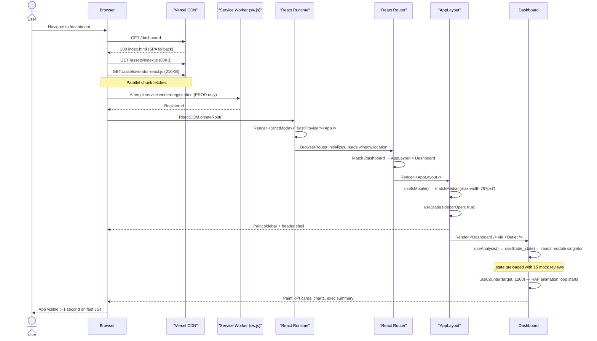
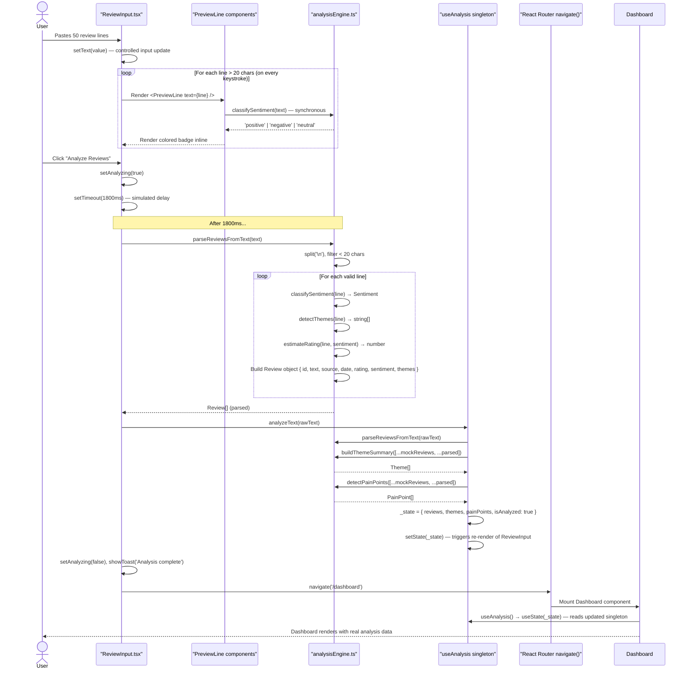
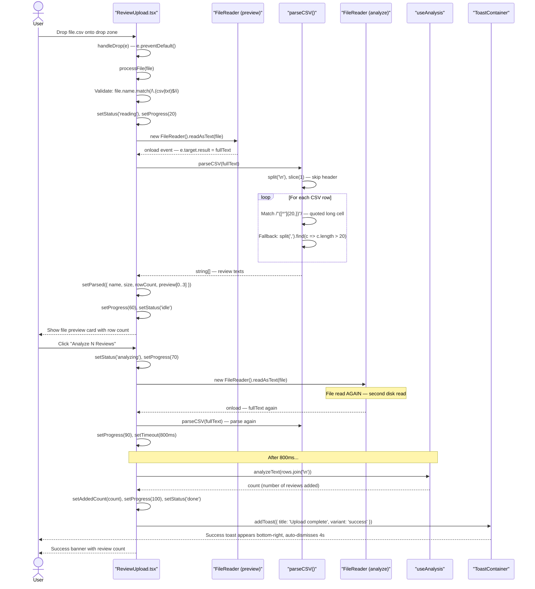
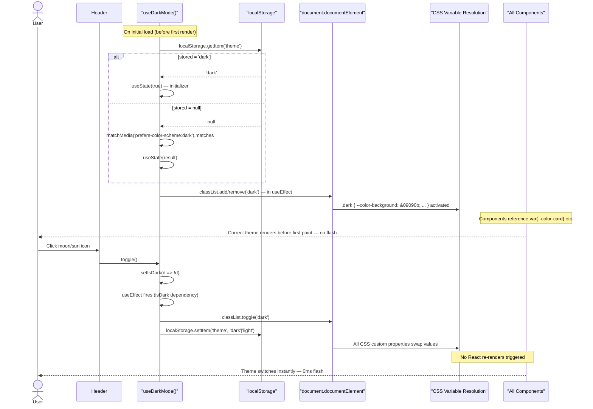
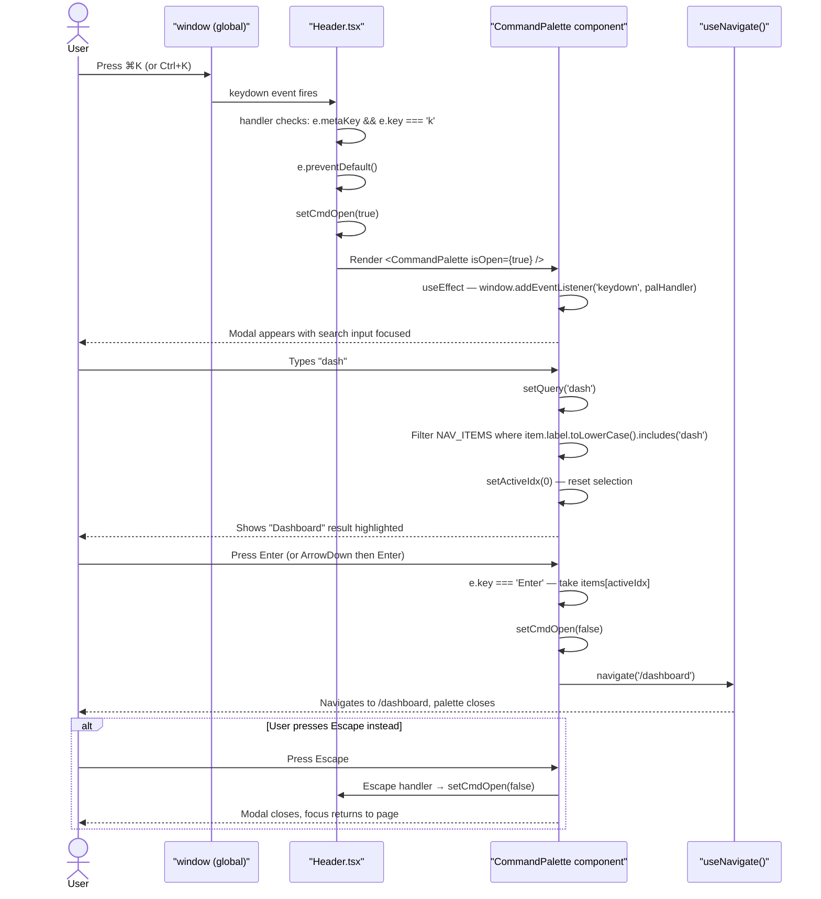
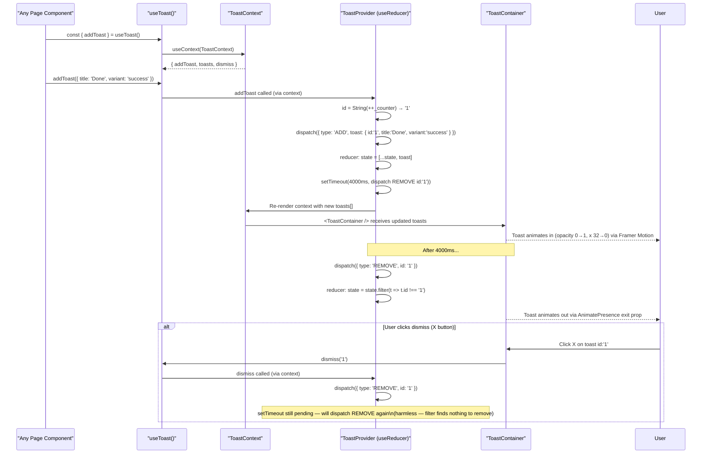
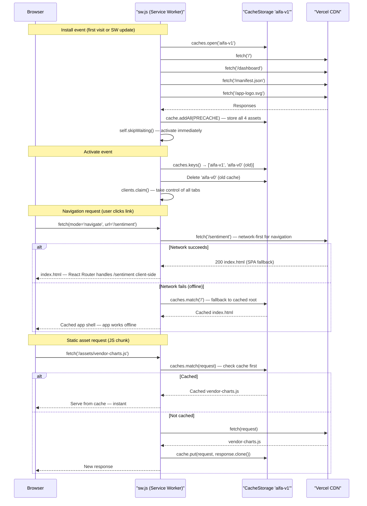
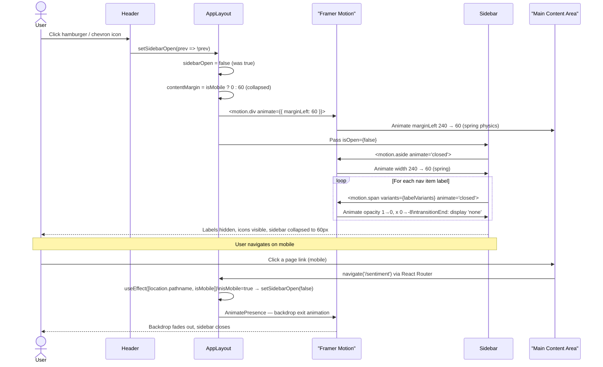

# Sequence Diagrams — AI Feedback Analyzer

Every major user flow represented as a sequence diagram. These trace exact code paths through the component tree.

---

## 1. App Initialization Sequence

From URL entry to first paint.



---

## 2. Text Input Analysis Sequence

User pastes reviews and clicks Analyze.



---

## 3. CSV File Upload Sequence



---

## 4. Dark Mode Toggle Sequence



---

## 5. Command Palette Sequence (⌘K)



---

## 6. Export Flow Sequence

```mermaid
sequenceDiagram
    actor User
    participant Export as "Export.tsx"
    participant State as "useAnalysis()"
    participant Toast as "useToast()"
    participant DOM as "Browser DOM/API"
    participant File as "File System"

    User->>Export: Select "CSV" format, click "Export CSV"
    Export->>State: const { reviews } = useAnalysis()
    State-->>Export: Review[] (current analysis state)

    Export->>Export: Build header: ['ID','Text','Source','Date','Rating','Sentiment','Themes']
    loop For each review
        Export->>Export: Escape quotes: text.replace(/"/g, '""')
        Export->>Export: Build CSV row array
    end
    Export->>Export: Join rows with '\n' → csvString

    Export->>DOM: new Blob([csvString], { type: 'text/csv;charset=utf-8;' })
    Export->>DOM: URL.createObjectURL(blob) → objectURL
    Export->>DOM: document.createElement('a')
    Export->>DOM: a.href = objectURL, a.download = 'feedback-reviews-2025-01-01.csv'
    Export->>DOM: document.body.appendChild(a)
    Export->>DOM: a.click() — triggers browser save dialog
    Export->>DOM: document.body.removeChild(a)
    Export->>DOM: setTimeout(100ms) → URL.revokeObjectURL(objectURL)

    Export->>Toast: addToast({ title: 'CSV downloaded', description: '150 reviews exported', variant: 'success' })
    Toast-->>User: Success notification, 4s auto-dismiss

    DOM-->>File: Browser saves reviews-2025-01-01.csv to Downloads

    alt User selects PDF instead
        User->>Export: Select "PDF", click "Print / Save PDF"
        Export->>Toast: addToast({ title: 'Opening print dialog', variant: 'default' })
        Export->>Export: setTimeout(400ms)
        Export->>DOM: window.print()
        DOM->>DOM: Apply @media print CSS\n(hide sidebar, header, nav)\n(full-width content)
        DOM-->>User: Browser print dialog opens
        User->>File: Select "Save as PDF" — browser generates PDF
    end
```

---

## 7. Toast Notification Sequence



---

## 8. Service Worker Cache Flow



---

## 9. Sidebar Animation Sequence


